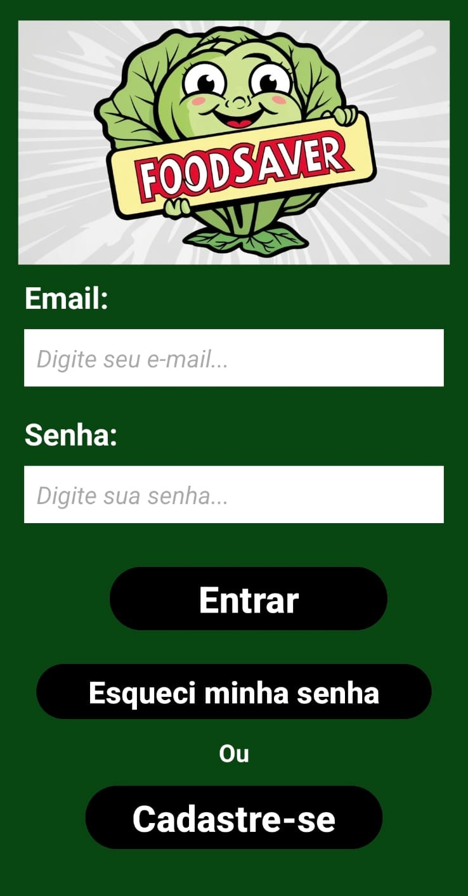
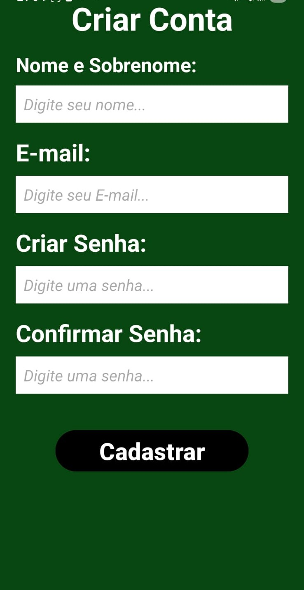
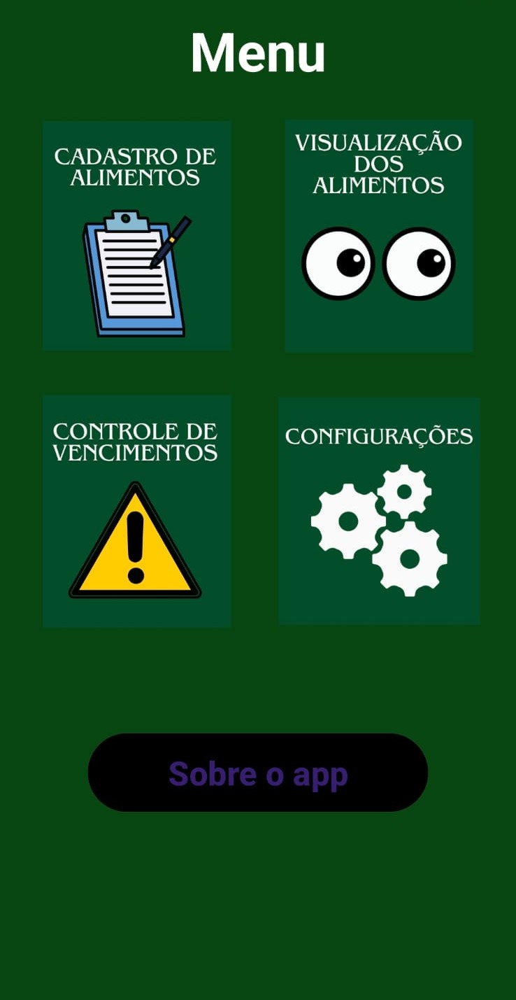
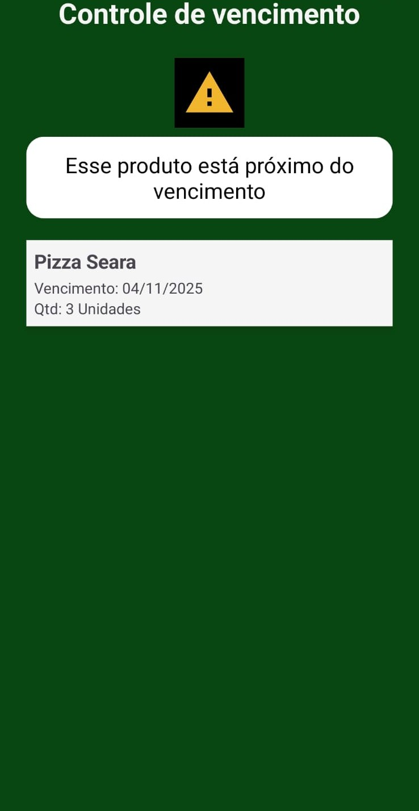
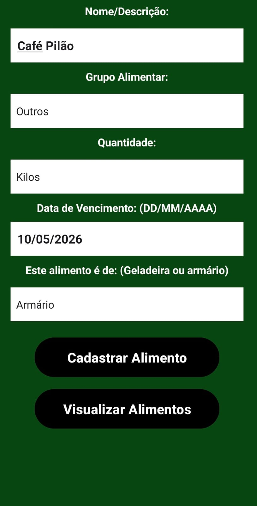
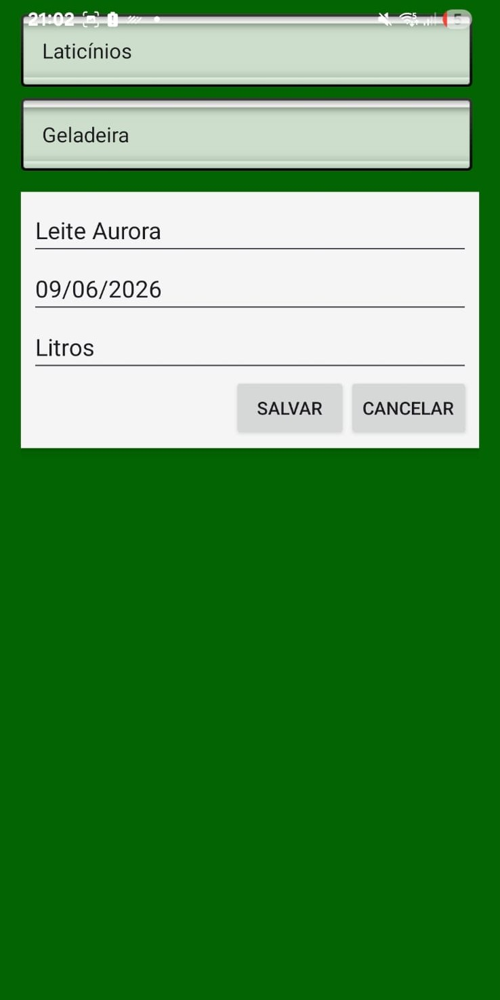
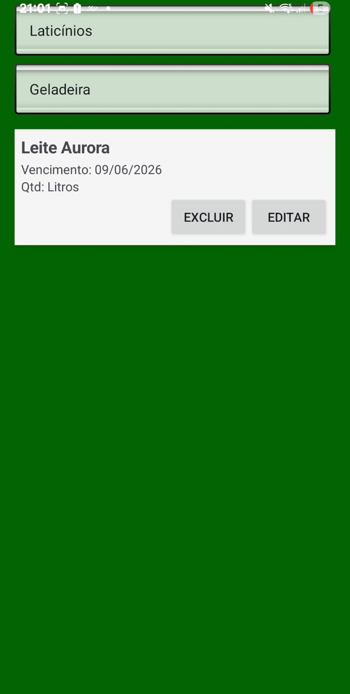
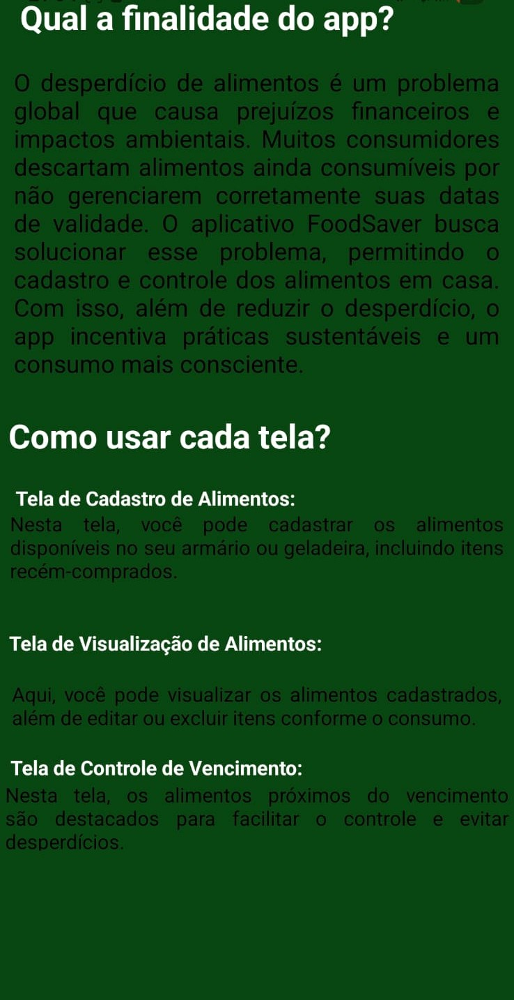
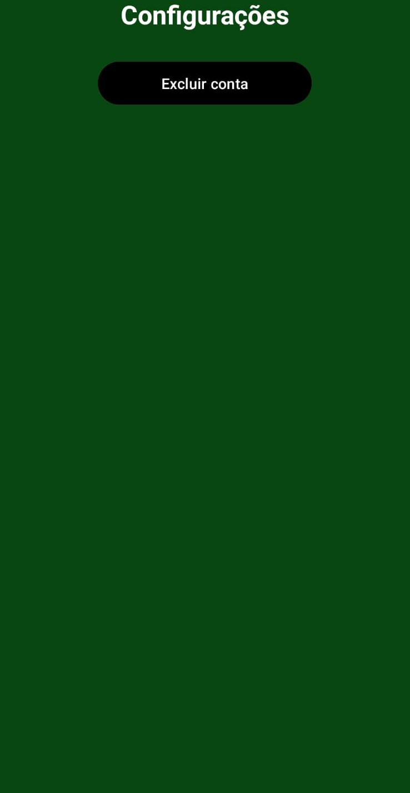

# FoodSaver 📱


Projeto acadêmico de um aplicativo Android para gerenciamento de alimentos e combate ao desperdício.

## 🎯 Objetivo Principal

O FoodSaver é um aplicativo móvel desenvolvido para ajudar no controle de alimentos domésticos. Seu principal objetivo é **reduzir o desperdício de alimentos** através do monitoramento de datas de validade.

Os usuários podem registrar seus alimentos, categorizá-los por local de armazenamento (geladeira, armário, freezer) e, o mais importante, definir a data de validade. O aplicativo então destaca os itens que estão próximos do vencimento.

## ✨ Funcionalidades Principais

* **Cadastro de Alimentos:** Registre novos itens de forma simples.
* **Categorização:** Separe os alimentos por "Geladeira", "Armário", "Congelador", etc.
* **Controle de Validade:** Defina a data de vencimento de cada item.
* **Alertas:** A aplicação destaca os alimentos próximos do vencimento.
* **Controle de Inventário:** Tenha uma visão clara do que você possui em casa.

## 🛠️ Tecnologias Utilizadas

Este projeto foi construído utilizando:

* **Java**
* **Android Studio**
* **SQLite**
  
## 🚀 Como Executar o Projeto (Para Desenvolvedores)

Para visualizar e compilar o código-fonte em sua máquina, siga os passos:

1.  **Clone o repositório:**
    ```bash
    git clone [https://github.com/SEU-USUARIO/SEU-REPOSITORIO.git](https://github.com/SEU-USUARIO/SEU-REPOSITORIO.git)
    ```
2.  **Abra no Android Studio:**
    * Abra o Android Studio.
    * Selecione "Open an existing project" (Abrir um projeto existente).
    * Navegue até a pasta onde você clonou o projeto e selecione-a.
3.  **Sincronize o Gradle:** O Android Studio irá automaticamente baixar as dependências (aguarde a conclusão do "Gradle sync").
4.  **Execute o App:** Conecte um dispositivo Android via USB (com modo de desenvolvedor ativado) ou inicie um Emulador (AVD) e clique em "Run" (▶).

## 📱 Como Instalar o Aplicativo (Para Usuários)

Você pode baixar o arquivo `.apk` (o instalador do app) diretamente da seção **Releases** deste repositório.

* [Clique aqui para ir para a página de Releases](https://github.com/sofiacelis/FoodSaver/releases/tag/v1.0.0)

(Você precisará criar essa "Release", vou explicar abaixo).

## 🖼️ Screenshots

| Tela de Login | Tela de Cadastro | Tela Principal (Menu) | Alerta de Vencimento |
| :---: | :---: | :---: | :---: |
|  |  |  |  |

| Cadastro de Alimentos | Editar/Excluir Alimentos | Visualizar Alimentos Cadastrados |
| :---: | :---: | :---: |
|  |   |  |

| Sobre o App | Recuperar Senha | Configurações |
| :---: | :---: | :---: |
|  |  |  |

## 🎓 Contexto Acadêmico

Este projeto foi desenvolvido como um trabalho para a disciplina Programação para Dispositivo Android do curso de Sistemas de Informação na instituição Eniac.

## 👨‍💻 Autores

* Sofia Gomes Celis - (https://github.com/sofiacelis)
* Isabella Zucchini - (https://github.com/Zucchiniisa)
* Luiza Celis Leite Cunha 
